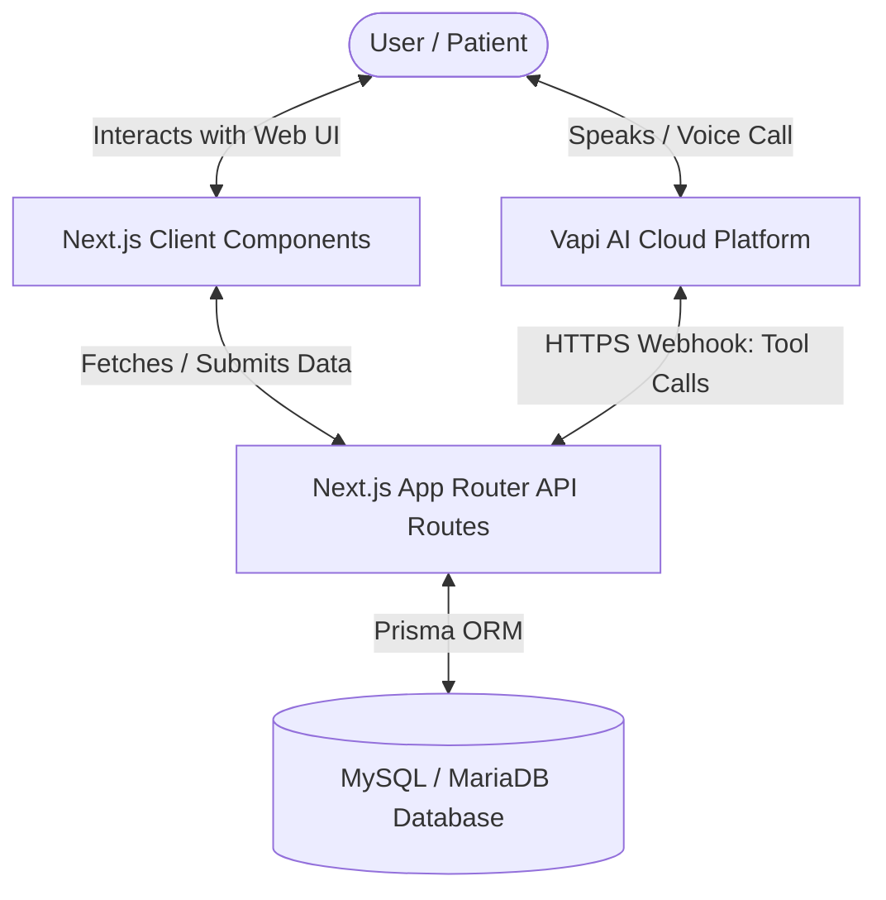

# CareConnect — AI Voice Agent & Hospital Appointment Scheduling System

CareConnect is a modern, full-stack hospital appointment scheduling application built with **Next.js 16**, **Prisma ORM**, **Tailwind CSS 4**, and **Vapi AI**. It allows hospital staff or patients to browse doctors, view profiles/availability, and book, cancel, or update appointments—either through the responsive **Web UI** or by speaking naturally to a **Vapi AI Voice Assistant**.

---

## 🏗️ System Architecture



---

## 🌟 Key Features

- **Doctor Discovery Dashboard**: Searchable and filterable list of 25+ pre-seeded doctors across major specialties (Cardiology, Pediatrics, Neurology, etc.).
- **Manual Booking & Management**: Check real-time doctor schedule slots and book or cancel appointments directly via the web dashboard.
- **AI Voice Assistant Integration**: In-app voice call button utilizing `@vapi-ai/web`. Users can book, cancel, or reschedule appointments by talking to the agent.
- **Fuzzy Name & Time Matching**: The voice agent handles natural speech (e.g., stripping "Dr." prefix, matching flexible timeslot phrases like "9 AM" to `"9:00 AM - 12:00 PM"`).
- **Double-Booking Prevention**: Validates doctors' schedules and blocks conflicting appointment times, throwing clean database-level conflicts (`409 Conflict`).
- **Optimistic UI Updates**: Instant updates in the UI when cancelling appointments, with automatic rollback if the API request fails.
- **Background Synchronization**: Automatically re-fetches appointments when a voice call terminates to sync changes made during the conversation.

---

## 🛠️ Technology Stack

| Layer | Technology |
|---|---|
| **Framework** | Next.js 16 (App Router) |
| **Language** | TypeScript |
| **UI Styling** | Tailwind CSS 4 |
| **Database ORM** | Prisma 7 |
| **Database Engine** | MySQL / MariaDB (or any SQL compatible via Prisma) |
| **Voice Service** | Vapi Web SDK (`@vapi-ai/web`) + REST API Webhooks |

---

## 📂 Project File Structure

```
ai-voice-agent-hospital/
├── app/
│   ├── api/
│   │   ├── appointments/
│   │   │   ├── route.ts              # GET (list) & POST (create) appointments
│   │   │   └── [id]/
│   │   │       └── route.ts          # DELETE (cancel) & PATCH (update) appointment
│   │   └── vapi/
│   │       └── webhook/
│   │           └── route.ts          # POST — Vapi webhook tool execution handler
│   ├── globals.css                   # Tailwind CSS global styles
│   ├── layout.tsx                    # Root layout template
│   ├── page.tsx                      # Server Page (Renders layout and seeds client state)
│   └── SchedulingClient.tsx          # Main interactive dashboard & Vapi Web SDK integration
├── lib/
│   └── prisma.ts                     # Prisma Client singleton
├── prisma/
│   ├── schema.prisma                 # Prisma schema definition
│   ├── seed.ts                       # Seed script for doctors & schedules
│   └── migrations/                   # SQL migration files
├── package.json                      # Scripts & dependencies
├── tsconfig.json                     # TypeScript configuration
├── .env.example                      # Environment variables template
└── .env                              # Active environment variables (git-ignored)
```

---

## 🚀 Setup & Installation

### 1. Clone & Install Dependencies
Navigate to the project directory and run:
```bash
npm install
```

### 2. Configure Environment Variables
Create a `.env` file in the root directory. You can copy the values from `.env.example`:
```bash
cp .env.example .env
```
Fill in the following variables:
- `DATABASE_URL`: Connection string to your MySQL or MariaDB instance.
- `NEXT_PUBLIC_VAPI_PUBLIC_KEY`: Obtained from your **Vapi Dashboard** → **Account/Settings** → **API Keys**.
- `NEXT_PUBLIC_VAPI_ASSISTANT_ID`: The unique ID of your Vapi assistant.

### 3. Database Initialization
Generate the Prisma Client, run migrations to create tables, and seed the database with mock doctor and schedule data:
```bash
npx prisma migrate dev
npx prisma db seed
```

### 4. Start the Development Server
```bash
npm run dev
```
Open [http://localhost:3000](http://localhost:3000) to view the application.

---

## 🎙️ Vapi Assistant Webhook & Tools Setup

For the Voice Assistant to interact with the database, Vapi needs to make webhook requests to your local server.

### 1. Tunnel Your Local Server
Since Vapi runs in the cloud, you must expose your local development server to the internet using a tool like **ngrok**:
```bash
ngrok http 3000
```
Copy the generated public forwarding URL (e.g., `https://xxxx-xxxx.ngrok-free.app`).

### 2. Configure the Vapi Dashboard
1. Go to the [Vapi Dashboard](https://dashboard.vapi.ai).
2. Select your **Assistant**.
3. Under **Settings**, paste your ngrok URL with the webhook path into the **Server URL** field:
   ```
   https://YOUR_NGROK_SUBDOMAIN.ngrok-free.app/api/vapi/webhook
   ```
4. Alternatively, you can update this programmatically using the Vapi REST API (see the [vapiConfigGuide.md](file:///d:/02_CODE/04_TEST/VOXAGENT/ai-voice-agent-hospital/notes/vapiConfigGuide.md)).

### 3. Configure Assistant Tools in Vapi
In your Vapi assistant settings, define the following tools with the exact JSON specifications:

#### Tool 1: `bookAppointment`
- **Function Name**: `bookAppointment`
- **Description**: Books an appointment for a patient with a doctor.
- **Parameters Schema**:
```json
{
  "type": "object",
  "properties": {
    "patientName": { "type": "string", "description": "Full name of the patient" },
    "doctorName": { "type": "string", "description": "Full name of the doctor" },
    "day": { "type": "string", "description": "Day of the week (e.g. Monday)" },
    "timeSlot": { "type": "string", "description": "Time slot (e.g. 9:00 AM - 12:00 PM)" }
  },
  "required": ["patientName", "doctorName", "day", "timeSlot"]
}
```

#### Tool 2: `cancelAppointment`
- **Function Name**: `cancelAppointment`
- **Description**: Cancels an existing appointment.
- **Parameters Schema**:
```json
{
  "type": "object",
  "properties": {
    "patientName": { "type": "string", "description": "Full name of the patient" },
    "doctorName": { "type": "string", "description": "Name of the doctor (optional)" }
  },
  "required": ["patientName"]
}
```

#### Tool 3: `updateAppointment`
- **Function Name**: `updateAppointment`
- **Description**: Updates an existing appointment to a new doctor, day, or time slot.
- **Parameters Schema**:
```json
{
  "type": "object",
  "properties": {
    "patientName": { "type": "string", "description": "Full name of the patient" },
    "doctorName": { "type": "string", "description": "Current doctor name to find the appointment" },
    "newDoctorName": { "type": "string", "description": "New doctor name (if changing)" },
    "newDay": { "type": "string", "description": "New day (if changing)" },
    "newTimeSlot": { "type": "string", "description": "New time slot (if changing)" }
  },
  "required": ["patientName"]
}
```

---

## 📡 API Endpoints Reference

### Web Application Routes

#### `GET /api/appointments`
- **Description**: Fetch all scheduled appointments in descending chronological order.
- **Response**: `200 OK` (JSON array of appointments with related doctor profiles).

#### `POST /api/appointments`
- **Description**: Create a new appointment from the manual booking form.
- **Request Body**:
  ```json
  { "doctorId": "cuid", "patientName": "John Doe", "day": "Monday", "timeSlot": "9:00 AM - 12:00 PM" }
  ```
- **Response**: `201 Created` / `400 Bad Request` / `404 Not Found`.

#### `DELETE /api/appointments/[id]`
- **Description**: Cancel a specific appointment.
- **Response**: `200 OK` / `404 Not Found`.

#### `PATCH /api/appointments/[id]`
- **Description**: Update fields on an existing appointment.
- **Request Body**: Partial updates for `patientName`, `doctorId`, `day`, or `timeSlot`.
- **Response**: `200 OK` / `409 Conflict` (double-booking) / `404 Not Found`.

---

### Vapi Webhook Route

#### `POST /api/vapi/webhook`
- **Description**: Public endpoint triggered by the Vapi AI service when the voice assistant invokes tools.
- **Request Format**: Receives `tool-calls` messages mapping to `bookAppointment`, `cancelAppointment`, or `updateAppointment`.
- **Response Format**:
  ```json
  {
    "results": [
      {
        "toolCallId": "call_abc123",
        "result": "Human-readable success or error explanation"
      }
    ]
  }
  ```

---

## 🗄️ Database Schema Summary

The database uses three tables:
- **`doctor`**: Stores profile information, specialties, contact details, and experience.
- **`schedule`**: Tied to `doctor` (one-to-many relation). Represents doctor's availability days and comma-separated timeslots.
- **`appointment`**: Ties a `patientName` to a `doctor` on a specific `day` and `timeSlot`.

See [prisma/schema.prisma](file:///d:/02_CODE/04_TEST/VOXAGENT/ai-voice-agent-hospital/prisma/schema.prisma) for exact database structures and types.

---

## 🧠 Key Design & Implementation Decisions

1. **Fuzzy Matching**: Implemented in the webhook router to remove friction from natural spoken input. For instance, prefixes like "Dr." are stripped, and names or times are evaluated via substring comparisons rather than strict exact matches.
2. **Force-Dynamic Page Load**: Set `export const dynamic = 'force-dynamic'` in `app/page.tsx`. This bypasses static page generation caching, ensuring the appointments list is re-evaluated live.
3. **Synchronized Client Refetching**: The Vapi Web SDK call ends hook triggers a silent client-side refresh of the appointments list, keeping the Web UI in lockstep with choices made via the voice system.
