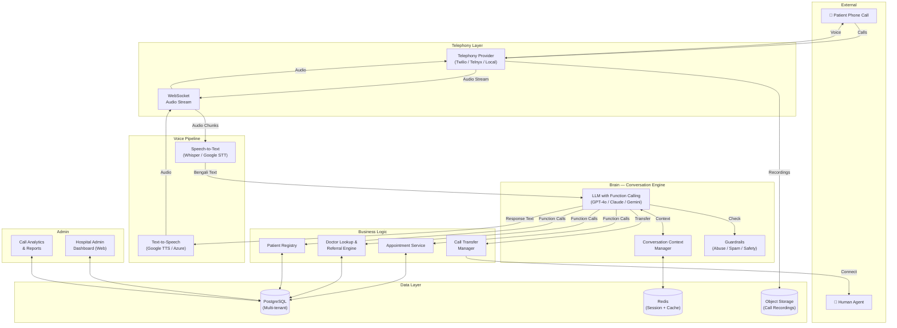
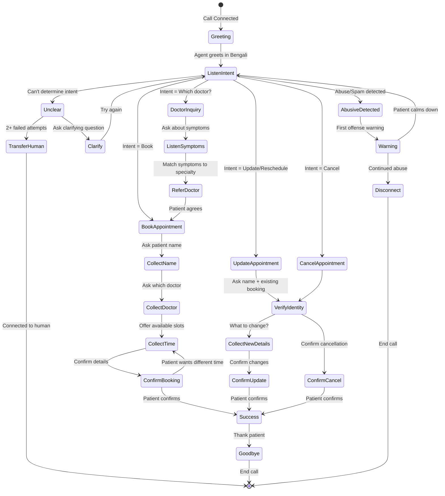
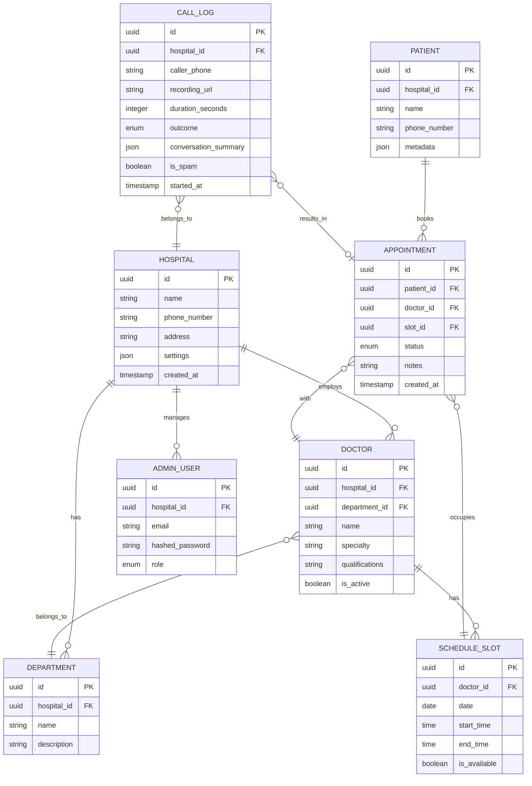

# VoxAgent — AI Voice Agent for Hospital Customer Service

## Problem Statement

Hospitals in Bangladesh spend significant human resources on phone-based customer service — appointment booking, rescheduling, cancellation, and doctor referrals. VoxAgent replaces this with an AI voice agent that handles calls in **Bengali**, understands patient needs, and manages appointments autonomously — while gracefully transferring to a human when needed.

**Business Model**: B2B SaaS — sell the software to hospitals as a managed service.

---

## User Review Required

> [!IMPORTANT]
> **This plan contains multiple open questions (Section below) that will significantly impact architecture, cost, and timeline.** Please review and answer them before I begin execution. Some decisions (like telephony provider and LLM choice) are foundational — changing them later is expensive.

> [!WARNING]
> **Bengali dialect handling is the single hardest technical challenge in this project.** No off-the-shelf STT model handles Noakhali/Chittagong dialects well. The plan includes mitigation strategies, but perfect dialect recognition may require custom fine-tuning over time with real call data.

> [!CAUTION]
> **Healthcare data is sensitive.** Even for an MVP, you need to think about patient data privacy from day one. Bangladesh's Digital Security Act and potential HIPAA-like requirements (if you ever expand) mean you cannot treat data handling as an afterthought.

---

## Open Questions

These questions will directly impact the implementation. Please answer as many as you can:

### 🏥 Business & Product

| # | Question | Why It Matters |
|---|----------|----------------|
| 1 | **Do you have a pilot hospital lined up?** | Determines if we build generic-first or tailor to one hospital's workflow |
| 2 | **How do hospitals currently manage appointments?** (Paper? Excel? Existing software?) | Determines integration complexity — we may need to BE the appointment system vs. integrate with one |
| 3 | **How many doctors/departments does a typical target hospital have?** | Affects database schema and conversation flow complexity |
| 4 | **Will you charge per-call, per-month flat, or per-seat?** | Affects how we meter usage and build billing |
| 5 | **Do you have a budget range for cloud/API costs during development?** | LLM + telephony + STT/TTS costs add up fast — affects which providers we choose |

### 📞 Telephony & Infrastructure

| # | Question | Why It Matters |
|---|----------|----------------|
| 6 | **Do you plan to use a local BD phone number or a VoIP solution?** | Twilio has limited BD support; may need a local provider like Telnyx, or a BD telecom partner |
| 7 | **Should the agent handle multiple simultaneous calls?** | Affects concurrency architecture (critical for a real hospital) |
| 8 | **Do you want call recording for quality assurance?** | Legal & storage implications; very useful for improving the model |

### 🤖 AI & Language

| # | Question | Why It Matters |
|---|----------|----------------|
| 9 | **Which LLM do you prefer?** (GPT-4o, Claude, Gemini, open-source like Llama?) | Cost, latency, Bengali capability, and vendor lock-in tradeoffs |
| 10 | **Is English fallback acceptable?** (If patient switches to English mid-call) | Simplifies or complicates the language pipeline |
| 11 | **How should the agent's voice sound?** (Male/female, formal/friendly tone?) | Affects TTS voice selection and prompt engineering |

### 👥 Team & Timeline

| # | Question | Why It Matters |
|---|----------|----------------|
| 12 | **What are your 2 friends' roles?** (Business dev? Design? Testing?) | Determines how much you're building solo vs. what can be delegated |
| 13 | **What's your target timeline for a working demo?** | Determines MVP scope |
| 14 | **Are you comfortable with Python (FastAPI) as the backend?** | Best AI/ML ecosystem, but want to confirm your proficiency |

---

## System Architecture

### High-Level Overview



### Component Breakdown

---

### 1. Telephony Layer

**Purpose**: Accept incoming phone calls, stream audio bidirectionally.

| Option                   | Pros                                          | Cons                                 |
| ------------------------ | --------------------------------------------- | ------------------------------------ |
| **Twilio**               | Most mature, great docs, WebSocket streaming  | Limited BD number support, expensive |
| **Telnyx**               | Good BD support, cheaper, real-time streaming | Smaller community                    |
| **Local BD Telecom API** | Native numbers, cheap                         | Poor API quality, limited docs       |
| **Vonage**               | Good Asian market support                     | Middle ground on everything          |

> [!TIP]
> **Recommended**: Start with **Telnyx** or **Twilio** for the MVP. Both support media streaming via WebSocket. Evaluate BD local providers for production cost optimization later.

**Key Implementation Details**:
- WebSocket-based audio streaming (not batch — we need real-time)
- Support for DTMF (keypad input) as fallback
- Call queuing when all agent slots are busy
- Graceful call transfer to human agent via SIP/warm transfer

---

### 2. Speech-to-Text (STT) Pipeline

**Purpose**: Convert Bengali audio to text in real-time.

| Option                           | Bengali Quality | Dialect Handling    | Latency        | Cost       |
| -------------------------------- | --------------- | ------------------- | -------------- | ---------- |
| **OpenAI Whisper (API)**         | ★★★★☆           | Moderate            | ~1-2s          | $0.006/min |
| **Google Cloud Speech V2**       | ★★★★☆           | Good (bn-BD locale) | ~0.5-1s        | $0.009/min |
| **Azure Speech**                 | ★★★☆☆           | Limited             | ~0.5-1s        | $0.01/min  |
| **Self-hosted Whisper Large V3** | ★★★★★           | Best (fine-tunable) | Depends on GPU | GPU cost   |

> [!TIP]
> **Recommended**: Use **Google Cloud Speech V2** for real-time streaming (lowest latency) with **Whisper** as a secondary verification pass for low-confidence transcriptions. For production at scale, move to **self-hosted Whisper Large V3** fine-tuned on BD dialect data.

**Dialect Mitigation Strategy**:
1. **Phase 1 (MVP)**: Use standard Bengali STT + LLM-based "dialect normalization" (the LLM can interpret dialectal Bengali from imperfect transcriptions)
2. **Phase 2**: Collect call recordings (with consent) → build a dialect-specific fine-tuning dataset
3. **Phase 3**: Fine-tune Whisper on Noakhali/Chittagong/Sylheti dialect data

---

### 3. Conversation Engine (The "Brain")

**Purpose**: Understand patient intent, manage multi-turn dialogue, execute actions.

This is the core of VoxAgent. We use an **LLM with function calling** as the conversation engine.

**Conversation Flow**:



**LLM Function Calling Schema** (the tools the LLM can invoke):

```python
# Core functions the LLM can call during conversation
functions = [
    {
        "name": "book_appointment",
        "description": "Book a new appointment for a patient",
        "parameters": {
            "patient_name": "string",
            "doctor_name": "string (optional)",
            "department": "string (optional)",
            "preferred_date": "string (ISO date)",
            "preferred_time_slot": "string",
            "symptoms": "string (optional, for referral)"
        }
    },
    {
        "name": "update_appointment",
        "description": "Update/reschedule an existing appointment",
        "parameters": {
            "patient_name": "string",
            "appointment_id": "string",
            "new_date": "string (optional)",
            "new_time_slot": "string (optional)",
            "new_doctor": "string (optional)"
        }
    },
    {
        "name": "cancel_appointment",
        "description": "Cancel an existing appointment",
        "parameters": {
            "patient_name": "string",
            "appointment_id": "string",
            "reason": "string (optional)"
        }
    },
    {
        "name": "lookup_doctor",
        "description": "Find a doctor based on symptoms or specialty",
        "parameters": {
            "symptoms": "string (optional)",
            "specialty": "string (optional)",
            "preferred_date": "string (optional)"
        }
    },
    {
        "name": "check_availability",
        "description": "Check available time slots for a doctor",
        "parameters": {
            "doctor_name": "string",
            "date": "string (ISO date)"
        }
    },
    {
        "name": "transfer_to_human",
        "description": "Transfer call to human agent",
        "parameters": {
            "reason": "string",
            "context_summary": "string"
        }
    },
    {
        "name": "lookup_patient_appointments",
        "description": "Find existing appointments for a patient",
        "parameters": {
            "patient_name": "string",
            "phone_number": "string (optional)"
        }
    }
]
```

**System Prompt Design** (critical for Bengali + safety):

The system prompt will instruct the LLM to:
- Always respond in Bengali (Bangla script or romanized, depending on TTS)
- Maintain a polite, professional hospital receptionist persona
- Handle dialectal input gracefully (interpret Noakhali/Chittagong expressions)
- Never provide medical advice — only schedule management
- Detect and flag abusive/spam behavior
- Escalate to human after 2 failed understanding attempts
- Keep responses concise (phone conversations need to be fast)

---

### 4. Text-to-Speech (TTS) Pipeline

**Purpose**: Convert agent's Bengali text responses to natural-sounding speech.

| Option | Bengali Quality | Voice Variety | Latency | Cost |
|--------|----------------|--------------|---------|------|
| **Google Cloud TTS** | ★★★★☆ | Multiple bn-BD voices | Fast | $4/1M chars |
| **Azure Neural TTS** | ★★★★☆ | Good quality | Fast | $4/1M chars |
| **ElevenLabs** | ★★★☆☆ | Custom voice cloning | Medium | Expensive |
| **Coqui/XTTS (self-hosted)** | ★★★☆☆ | Fully customizable | Depends | GPU cost |

> [!TIP]
> **Recommended**: **Google Cloud TTS** (bn-BD) for MVP. It has the most natural Bengali voices. Move to custom voice training later if brand voice matters.

---

### 5. Backend Services

**Tech Stack**:

| Component | Technology | Reason |
|-----------|-----------|--------|
| **Runtime** | Python 3.12+ | Best AI/ML ecosystem |
| **Framework** | FastAPI | Async, WebSocket support, fast |
| **Database** | PostgreSQL 16 | Robust, multi-tenant ready |
| **Cache/Sessions** | Redis | Call state, rate limiting |
| **Task Queue** | Celery + Redis | Background jobs (reports, recordings) |
| **Object Storage** | S3 / MinIO | Call recordings, logs |
| **Containerization** | Docker + Docker Compose | Dev parity, easy deployment |
| **Orchestration** | Kubernetes (later) | Production scaling |

**Database Schema (Core Tables)**:



---

### 6. Guardrails & Safety System

**Purpose**: Handle abuse, spam, and unsafe interactions.

```
┌─────────────────────────────────────────────┐
│              SAFETY PIPELINE                │
│                                             │
│  Incoming Call                              │
│      │                                      │
│      ▼                                      │
│  ┌──────────────┐   Blocked → Disconnect    │
│  │ Rate Limiter  │──────────────────────►    │
│  │ (per number)  │                          │
│  └──────┬───────┘                           │
│         │ Passed                             │
│         ▼                                    │
│  ┌──────────────┐   Spam Score > 0.8        │
│  │ Spam Detector │──────────────────────►    │
│  │ (# history)   │   Flag + Short response  │
│  └──────┬───────┘                           │
│         │ Clean                              │
│         ▼                                    │
│  ┌──────────────┐   Abusive detected        │
│  │ Abuse Filter  │──► Warning (1st time)    │
│  │ (per turn)    │──► Disconnect (2nd time) │
│  └──────┬───────┘                           │
│         │ Safe                               │
│         ▼                                    │
│  Normal Conversation Flow                   │
└─────────────────────────────────────────────┘
```

**Implementation Details**:
- **Rate Limiter**: Max 3 calls/hour from same number, max 10/day. Configurable per hospital.
- **Spam Detector**: Track repeat callers with no bookings, very short calls, known spam numbers
- **Abuse Filter**: Bengali profanity detection via keyword list + LLM classification. First offense = polite warning. Second = "আমি আপনাকে সাহায্য করতে পারছি না, ধন্যবাদ" (I cannot help you, thank you) → disconnect
- **Conversation Length Guard**: Max 5 minutes per call. Warn at 4 minutes, offer to transfer to human.

---

### 7. Admin Dashboard (Web)

**Purpose**: Hospital admins manage doctors, schedules, and monitor call performance.

**Tech**: React (Vite) + TypeScript + shadcn/ui

**Key Pages**:
- 🏠 **Dashboard**: Today's calls, booking stats, agent performance
- 👨‍⚕️ **Doctor Management**: Add/edit doctors, specialties, departments
- 📅 **Schedule Management**: Set available slots per doctor
- 📞 **Call Logs**: Review calls, listen to recordings, see transcripts
- 📊 **Analytics**: Call volume trends, resolution rate, peak hours
- ⚙️ **Settings**: Agent voice, greeting message, business hours, rate limits

---

## Multi-Tenancy (SaaS Architecture)

Since this is a SaaS product, every component must be tenant-aware:

| Aspect | Strategy |
|--------|----------|
| **Data Isolation** | Schema-per-tenant in PostgreSQL (strongest isolation) OR row-level security with `hospital_id` (simpler, start here) |
| **Phone Numbers** | Each hospital gets its own phone number |
| **LLM Context** | System prompt includes hospital-specific info (name, departments, policies) |
| **Voice/Greeting** | Configurable per hospital |
| **Billing** | Track API usage (LLM tokens, STT minutes, call minutes) per tenant |

> [!IMPORTANT]
> **Recommended for MVP**: Row-level security with `hospital_id` on every table. Migrate to schema-per-tenant only if you sign hospitals that demand strict data isolation.

---

## Proposed Changes — Project Structure

```
voxagent/
├── README.md
├── docker-compose.yml
├── .env.example
│
├── backend/                     # FastAPI Backend
│   ├── app/
│   │   ├── main.py              # FastAPI app entry
│   │   ├── config.py            # Settings & env vars
│   │   ├── database.py          # DB connection & sessions
│   │   │
│   │   ├── models/              # SQLAlchemy models
│   │   │   ├── hospital.py
│   │   │   ├── doctor.py
│   │   │   ├── patient.py
│   │   │   ├── appointment.py
│   │   │   ├── call_log.py
│   │   │   └── admin_user.py
│   │   │
│   │   ├── schemas/             # Pydantic schemas
│   │   │   ├── appointment.py
│   │   │   ├── doctor.py
│   │   │   └── ...
│   │   │
│   │   ├── api/                 # REST API routes
│   │   │   ├── appointments.py
│   │   │   ├── doctors.py
│   │   │   ├── hospitals.py
│   │   │   ├── call_logs.py
│   │   │   └── auth.py
│   │   │
│   │   ├── voice/               # Voice pipeline
│   │   │   ├── telephony.py     # Twilio/Telnyx WebSocket handler
│   │   │   ├── stt.py           # Speech-to-Text wrapper
│   │   │   ├── tts.py           # Text-to-Speech wrapper
│   │   │   ├── conversation.py  # LLM conversation engine
│   │   │   └── guardrails.py   # Abuse/spam detection
│   │   │
│   │   ├── services/            # Business logic
│   │   │   ├── appointment_service.py
│   │   │   ├── doctor_service.py
│   │   │   ├── patient_service.py
│   │   │   └── referral_engine.py
│   │   │
│   │   └── utils/
│   │       ├── bengali.py       # Bengali text utilities
│   │       └── security.py
│   │
│   ├── alembic/                 # DB migrations
│   ├── tests/
│   ├── requirements.txt
│   └── Dockerfile
│
├── dashboard/                   # React Admin Dashboard
│   ├── src/
│   │   ├── pages/
│   │   ├── components/
│   │   ├── hooks/
│   │   ├── services/
│   │   └── App.tsx
│   ├── package.json
│   └── Dockerfile
│
├── prompts/                     # LLM System Prompts
│   ├── system_prompt_bn.md      # Bengali system prompt
│   └── function_definitions.json
│
└── docs/
    ├── architecture.md
    ├── api_reference.md
    └── deployment.md
```

---

## Development Roadmap (Phased)

### Phase 1 — Foundation & Proof of Concept (Weeks 1-3)
> Goal: A working demo where you can call a number, speak in Bengali, and book an appointment.

| Task | Details |
|------|---------|
| Project setup | FastAPI project, Docker, PostgreSQL, Redis |
| Database models | Hospital, Doctor, Patient, Appointment, Schedule |
| STT integration | Google Cloud Speech or Whisper API |
| TTS integration | Google Cloud TTS (Bengali) |
| LLM conversation engine | GPT-4o/Claude with function calling |
| Basic telephony | Twilio/Telnyx WebSocket media streaming |
| Appointment booking flow | Book + confirm via voice |
| **Deliverable** | **Demo: Call → Book appointment in Bengali** |

### Phase 2 — Core Features (Weeks 4-6)
> Goal: All CRUD operations on appointments, doctor referral, human transfer.

| Task | Details |
|------|---------|
| Update/Cancel appointment flow | Full appointment lifecycle |
| Doctor referral engine | Symptom → specialty → doctor matching |
| Patient lookup | Find existing appointments by name/phone |
| Human agent transfer | Warm transfer with context |
| Call recording & logging | Store and index all calls |
| Guardrails v1 | Rate limiting, basic abuse detection |
| **Deliverable** | **Feature-complete voice agent** |

### Phase 3 — Admin Dashboard & Multi-tenancy (Weeks 7-9)
> Goal: Hospital admins can self-manage via web dashboard.

| Task | Details |
|------|---------|
| Admin authentication | JWT-based login |
| Doctor/schedule management UI | CRUD for doctors and time slots |
| Call logs & transcript viewer | Review past calls |
| Analytics dashboard | Call volume, resolution rate, peak hours |
| Multi-tenant data isolation | Row-level security, tenant-aware APIs |
| **Deliverable** | **Admin dashboard + multi-tenant backend** |

### Phase 4 — Hardening & Production (Weeks 10-12)
> Goal: Production-ready system for pilot hospital.

| Task | Details |
|------|---------|
| Dialect handling improvements | Prompt engineering + error recovery |
| Spam detection v2 | ML-based spam scoring |
| Load testing | Simulate concurrent calls |
| Security audit | Data encryption, access controls |
| Monitoring & alerting | Logs, error tracking, uptime |
| Deployment pipeline | CI/CD, staging environment |
| **Deliverable** | **Production deployment at pilot hospital** |

### Phase 5 — Scale & Improve (Ongoing)
> Goal: Grow the SaaS business.

| Task | Details |
|------|---------|
| Dialect fine-tuning | Custom Whisper model trained on real call data |
| Custom voice training | Hospital-branded TTS voice |
| Billing & subscription | Usage-based billing system |
| Onboarding flow | Self-service hospital signup |
| Mobile app for patients | Optional: appointment confirmation via SMS/app |

---

## Verification Plan

### Automated Tests
- **Unit tests**: Each service layer function (appointment CRUD, doctor lookup, referral matching)
- **Integration tests**: STT → LLM → TTS pipeline with sample Bengali audio files
- **API tests**: REST endpoint testing with pytest + httpx
- **Load tests**: Locust/k6 for concurrent call simulation

```bash
# Run test suite
cd backend && pytest tests/ -v --cov=app

# Run load test
k6 run tests/load/concurrent_calls.js
```

### Manual Verification
- **Voice quality test**: Make real calls in Bengali, test all 3 flows (book/update/cancel)
- **Dialect test**: Have native Noakhali/Chittagong speakers call and test comprehension
- **Abuse test**: Simulate abusive callers, verify warning → disconnect flow
- **Spam test**: Rapid-fire calls from same number, verify rate limiting
- **Human transfer test**: Verify warm transfer works with context handoff
- **Dashboard test**: Full admin workflow — add doctor, set schedule, view call logs

---

## Cost Estimation (MVP — Monthly)

| Service | Estimated Monthly Cost | Notes |
|---------|----------------------|-------|
| **LLM API** (GPT-4o) | $50-200 | ~500-2000 calls/month, ~$0.10/call |
| **STT** (Google/Whisper) | $20-50 | ~500 min/month |
| **TTS** (Google) | $10-20 | ~500 min/month |
| **Telephony** (Telnyx/Twilio) | $30-100 | Number + per-min charges |
| **Cloud hosting** | $50-100 | VPS/cloud for backend |
| **Database** | $0-20 | Self-hosted or managed |
| **Total MVP** | **~$160-490/month** | Before any revenue |

> [!NOTE]
> These costs scale linearly with call volume. At 5,000 calls/month, expect ~$800-1,500/month. Price your SaaS accordingly — hospitals should pay at least 3-5x your per-tenant cost for healthy margins.

---

## Key Risks & Mitigations

| Risk | Impact | Mitigation |
|------|--------|-----------|
| Bengali STT accuracy too low | Agent can't understand patients | Multi-model approach; LLM-based error correction; human fallback |
| Dialect barrier | 30-40% of callers not understood | Fine-tune on real data (Phase 5); aggressive human transfer |
| Latency too high | Unnatural conversation flow | Stream STT + TTS; optimize LLM response time; consider edge deployment |
| Telephony provider issues in BD | Calls drop or quality is poor | Test multiple providers; have failover; consider SIP trunking |
| Patient data breach | Legal liability, trust loss | Encrypt at rest + transit; audit logs; minimal data retention |
| Hospital reluctance to adopt | No customers | Start with one friendly pilot hospital; prove ROI with data |
